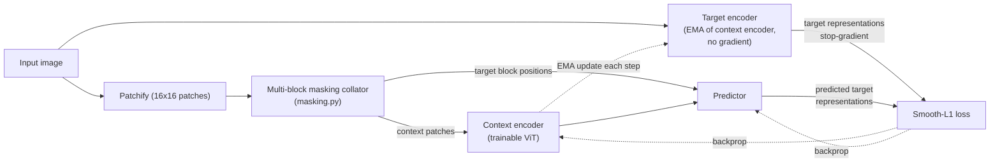
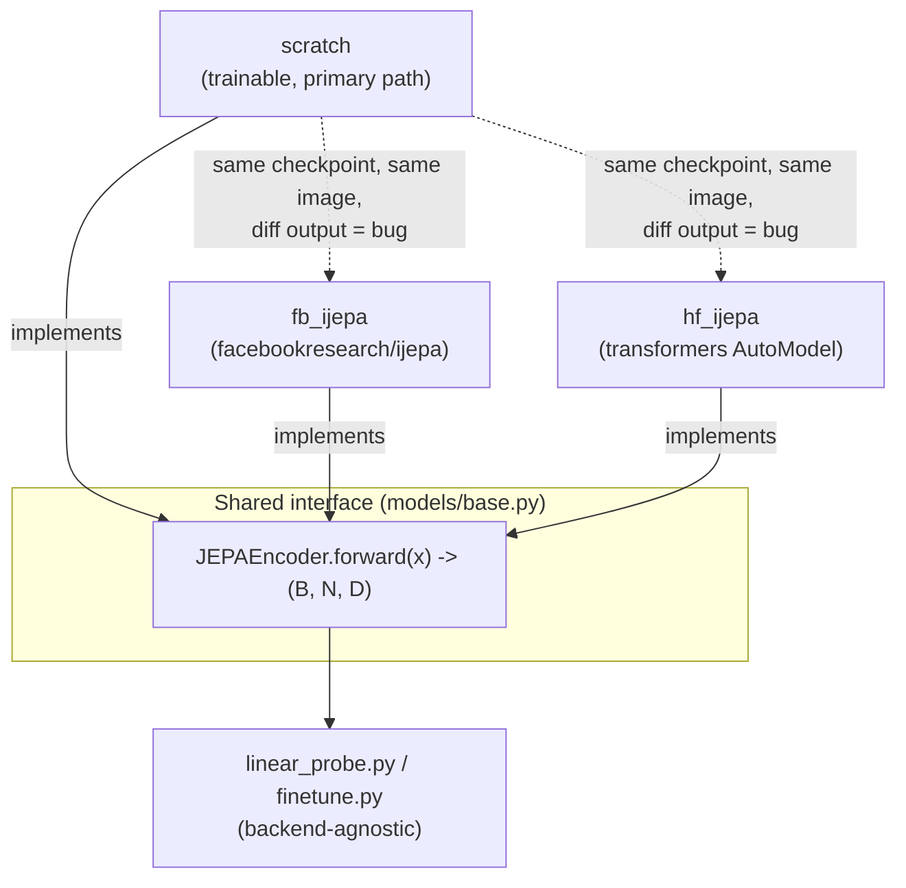
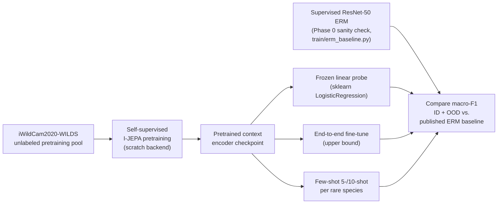

# Design

## Problem

Camera traps produce enormous volumes of unlabeled imagery, but labels for rare/long-tail
species are scarce, and supervised models trained on one set of camera deployments generalize
poorly to new locations (they latch onto camera-specific background/lighting/angle rather than
the animal). The standardized benchmark that exposes this is WILDS `iWildCam2020-WILDS`: 182
species, in-distribution test set from the same 243 cameras as training, out-of-distribution
test set from 48 *different* cameras. Published ERM (supervised ResNet-50) baseline scores
roughly 0.31-0.35 macro-F1 on the OOD split -- a large drop from in-distribution performance.

I-JEPA's self-supervised, masked-latent-prediction objective is a plausible fix: it never
reconstructs pixels, so it isn't rewarded for memorizing camera-specific texture/background
statistics, and it doesn't need contrastive negative sampling or hand-crafted augmentations.
Pretraining on abundant *unlabeled* camera-trap footage should, in principle, transfer better to
new cameras and rare species than supervised training on the same label budget.

Nobody has published an I-JEPA-specific approach to this problem (as of mid-2026 literature
search); DINOv2-based self-supervision has been shown to work well on a related camera-trap task
(face re-identification), which derisks the general "SSL beats supervised here" claim without
answering whether I-JEPA specifically is a good fit.

## Architecture overview

One training step, end to end: an image is patchified, the masking collator carves out context
and target blocks on the patch grid, the context encoder sees only context patches, the
predictor is asked to guess the target encoder's representations for the target blocks it never
saw, and the loss backpropagates into the context encoder and predictor only -- the target
encoder is never trained directly, only nudged via an EMA of the context encoder's weights.

This is the `IJEPA` composite module (`models/scratch/__init__.py`) that `train/pretrain.py`
actually trains -- `ScratchEncoder` (the context encoder alone) is what gets reused downstream
for linear-probe/fine-tune, since inference only ever needs context-encoder representations, not
the predictor or target encoder.

## Why implement from scratch instead of using facebookresearch/ijepa directly

Two reasons, in order of importance:

1. **Understanding.** The value of this project is partly in genuinely knowing how the masking
   strategy, predictor, and EMA target encoder work, not just running someone else's training
   script.
2. **A concrete correctness check.** Loading Meta's released pretrained weights into *our own*
   module definitions and diffing output embeddings against `facebookresearch/ijepa` and
   `transformers`' implementation on the same input is a much stronger validation signal than
   "the loss goes down." If they don't match within numerical tolerance, that's a bug with a
   ground truth to debug against.

This is why all three backends implement the same narrow interface
(`wildjepa.models.base.JEPAEncoder` / `JEPAPredictor`) — it's what's needed for both (a) running
identical linear-probe/fine-tune evaluation code regardless of backend, and (b) the diffing
check in (2).

| Backend | Role |
|---|---|
| `scratch` | Primary implementation. Where the actual pretraining objective is implemented and where we learn/debug. |
| `fb_ijepa` | Reference implementation (Meta's official repo) + strong pretrained baseline. |
| `hf_ijepa` | Reference implementation (Hugging Face wrapper) — faster to stand up than checking out `fb_ijepa`, same validation role. |

Keeping `JEPAEncoder` this narrow is what makes both the shared eval code *and* the
cross-backend correctness check possible: any backend that implements `forward` can be dropped
into `linear_probe.py`/`finetune.py` unchanged, and the same interface is what's diffed in
`tests/test_cross_backend.py`.

## Config: Hydra

Config groups (`backend`, `device`, `data`, `train`) compose independently via a defaults list,
so switching backend never touches device/data config and vice versa. This also gives CLI
overrides (`python scripts/train.py backend=fb_ijepa device=cuda`) and multirun sweeps for free,
which matter once we're comparing backends/hyperparameters at benchmark scale. Plain YAML +
argparse was the alternative; rejected because we'd end up hand-rolling this composition anyway.

## Device strategy

Plain PyTorch device resolution (`wildjepa.utils.device.resolve_device`): cuda > mps > cpu, no
`accelerate` dependency yet — unnecessary abstraction at single-device, quick-feasibility-check
scope. MPS caveats worth remembering: some ops silently fall back to CPU (slow), no distributed
training, mixed precision less stable than CUDA. `PYTORCH_ENABLE_MPS_FALLBACK=1` is set
automatically when device resolves to MPS.

## Evaluation protocol

Standard for this kind of study, in increasing order of rigor:
1. Frozen-encoder linear probe (matches the original I-JEPA paper's own evaluation protocol).
2. Full fine-tune (upper bound).
3. Few-shot per rare species (5-shot, 10-shot) — the most direct test of the label-efficiency
   claim that's the actual motivation for this project.

Primary metric: macro-F1 on `iWildCam2020-WILDS`, both in-distribution and out-of-distribution
test splits, compared against the published ERM baseline (~0.31-0.35 OOD).

The ERM baseline (left branch) exists to validate the comparison itself: if it doesn't land near
the published ~0.31-0.35 OOD macro-F1, the eval harness is untrustworthy and any I-JEPA number
built on top of it is meaningless, independent of whether I-JEPA "worked."

## What this phase deliberately does not do

- No domain-adaptive continued pretraining yet (Phase 2 in the original plan) — quick feasibility
  check first, on a small stratified species subset, small ViT (ViT-S/16), M2-sized compute.
- No DINOv2/MAE same-data control baseline yet — deferred by explicit choice; revisit once the
  scratch I-JEPA pipeline is validated. See `roadmap.md`.

## Implementation notes

The scaffold-stage stubs are now real. What's actually implemented, module by module:

**`models/scratch/`** -- a plain ViT (`vit.py`: `Attention`, `Mlp`, `Block`,
`VisionTransformer`), fixed 2D sin-cos positional embeddings (`pos_embed.py`), the
multi-block masking collator (`masking.py`), the predictor (`predictor.py`), EMA update +
momentum schedule (`ema.py`), and the smooth-L1 training objective (`loss.py`).
`ScratchEncoder`/`ScratchPredictor` (in `__init__.py`) satisfy the `JEPAEncoder`/`JEPAPredictor`
interfaces for eval use; `IJEPA` is the composite module (context encoder + EMA target encoder +
predictor) that `train/pretrain.py` actually trains.

Two implementation choices worth calling out because they trade a little theoretical purity for
tractability:

1. **Block size is sampled once per batch, shared across all samples and all target blocks in
   that call** (only block *position* varies per sample). This keeps target-block tensors a
   uniform `(B, K)` shape with no padding needed for the predictor. Context blocks still end up
   with a variable kept-patch count after target removal (handled via `gather_with_padding` +
   an attention key-padding mask). This mirrors how the official `facebookresearch/ijepa`
   collator behaves in practice, not a simplification unique to this project.
2. **Module and parameter names in `vit.py` mirror `facebookresearch/ijepa`'s
   `vision_transformer.py` naming** (`patch_embed.proj`, `blocks.N.{norm1,attn,norm2,mlp}`,
   `norm`) specifically so an official checkpoint loads via `load_state_dict(strict=False)` with
   minimal remapping -- see the cross-backend correctness check below.

**`data/`** -- `synthetic.py` is a fully self-contained, no-download dataset (distinct colored
blobs per class on noisy backgrounds) used for pipeline smoke tests and the automated
integration test (`tests/test_integration_tiny_pretrain.py`); `iwildcam.py` wraps the real WILDS
`iWildCam2020-WILDS` benchmark, including the stratified-subset logic (top-`N` species by
training-split frequency, capped images per species, computed once from the *training* split and
applied identically to every other split so eval labels stay meaningful, then remapped to a
contiguous label range).

**`train/`** -- `pretrain.py` runs the self-supervised objective (scratch backend only);
`linear_probe.py` extracts frozen features and fits a scikit-learn `LogisticRegression` (the
standard "linear evaluation" protocol in the SSL literature, avoiding a second hand-rolled
training loop just for a linear head); `finetune.py` unfreezes the encoder and trains an
`EncoderWithHead` end to end with cross-entropy. Both `linear_probe` and `finetune` work with
*any* backend, since they only depend on the shared `JEPAEncoder.forward` contract.

**`eval/`** -- macro-F1 (primary metric, matching the WILDS leaderboard), per-class F1, few-shot
index sampling (for the label-efficiency claim specifically), and a fixed table of published
baseline numbers with a split-name-to-baseline mapping (`baselines.py`) so `print_comparison`
knows that a `test_macro_f1` result is the OOD comparison and `id_test_macro_f1` is the ID one.

## Honest limitations (not yet verified end-to-end)

- **Verified on real hardware:** the full test suite (`pytest tests/`, 42/42) passes on real
  Apple Silicon (MPS); the real `iWildCam2020-WILDS` data (~12GB) is downloaded and the WILDS
  API path (`iwildcam.py` -- splits, stratified-subset selection, label remapping) has been
  exercised end to end against it, both via the `iwildcam_subset` smoke test and via the
  supervised ERM baseline (below) training against the full real benchmark; the scratch I-JEPA
  pipeline (masking, context/target encoding, prediction, loss, EMA update) has been verified
  end to end on the synthetic dataset, including the automated integration test that checks loss
  measurably decreases.
- **Not yet verified:** the scratch I-JEPA pretraining objective has only been run against the
  synthetic dataset so far, not real `iWildCam` data -- see `roadmap.md` Phase 1. The
  `fb_ijepa`/`hf_ijepa` checkpoint-key-mapping assumptions haven't been checked against a real
  official checkpoint (no checkpoint downloaded yet, no cross-backend embedding diff run). The
  Phase 0 ERM baseline (`scripts/train_erm_baseline.py`) is implemented and was confirmed to run
  correctly end to end, but its final reproduced macro-F1 number against the published
  ~0.31-0.35 OOD baseline is still pending a completed run. No real I-JEPA linear-probe numbers
  exist yet.

See `roadmap.md` for the exact remaining steps and their current status.
